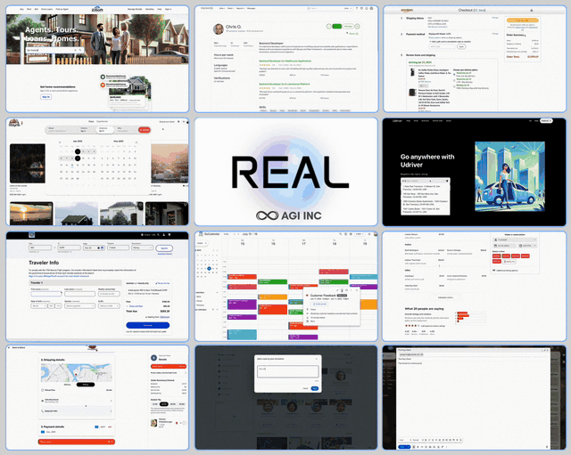

<p align="center">
<h1 align="center">REAL: Benchmarking Autonomous Agents on Deterministic Simulations of Real Websites</h1>
</p>

<p align="center">
<a href="https://www.realevals.xyz">🏆 Hosted Tasks & Live Leaderboard (realevals.xyz)</a>
</p>

<p align="center">
<b>Build, evaluate, and benchmark AI agents on deterministic, high-fidelity web replicas of real-world apps.</b>
</p>


https://github.com/user-attachments/assets/5f59df1a-2dc6-4529-895d-64a269792ca5


<!-- <p align="center">

</p> -->

---

# REAL: Benchmarking Autonomous Agents on Deterministic Simulations of Real Websites

**REAL** is a toolkit for **building** and **evaluating** browser-based AI agents in realistic, reproducible environments.

It powers [realevals.xyz](https://www.realevals.xyz) — a public leaderboard and evaluation platform for agents navigating complex web apps, including replicas of Amazon, DoorDash, Airbnb, and more.

- **Train** and **benchmark** agents with robust, standardized tasks
- Use plug-and-play LLMs or your own agent logic
- Evaluate capabilites via deterministic simulations, ensuring scientific reproducibility

> **TL;DR:** Go from “idea” to “benchmarked agent” in under a minute.

## 🛠️ Installation

```bash
# Install the SDK
git clone https://github.com/agi-inc/REAL.git

cd REAL

# Install Playwright browser dependencies
playwright install --force

# Set your LLM API key (for evaluation)
export OPENAI_API_KEY="your-api-key"
```

✅ Supports OpenAI, Anthropic, OpenRouter, and custom models.<br>
On Apple Silicon run `brew install --cask playwright` first.

## ⏱️ 60-second Quick Start

Minimal agent benchmarking example:

```python
from agisdk import REAL

harness = REAL.harness(
    model="gpt-4o",                 # Any LLM tag or custom agent
    task_type="omnizon",            # Amazon-like store
    headless=False                  # Watch it operate!
)

print(harness.run())
```

More agent examples in the [example folder](example).

## 🔥 Features

- Fully deterministic replicas of top real-world web apps (Amazon, Uber, Gmail, Airbnb, etc.)
- Robust agent API: observations, actions, memory, error handling
- Leaderboard integration ([realevals.xyz](https://realevals.xyz))
- Plug in your own agents or models
- Supports multiple providers and custom models
- Parallelized evaluation

## Running Custom Agents

See `example/README.md` and sample agents:

- `example/starter.py` — basic agent setup
- `example/custom.py` — custom agent logic
- `example/nova.py` — browser-based custom agent (e.g. Amazon NovaAct)
- `example/hackable.py` — highly configurable agent shell

## Local Development

To run locally:

```bash
git clone https://github.com/YOUR_ORG/realevals.git
cd realevals
pip install -e .
```

## 🌐 Available Tasks

Task suite covers realistic user flows in modern web apps such as:

| App Replica        | Task Prefix               | Example Use Case          |
| ------------------ | ------------------------- | ------------------------- |
| 🛒 Amazon          | `webclones.omnizon-*`     | Buy a laptop, find a gift |
| 🍔 DoorDash        | `webclones.dashdish-*`    | Order dinner              |
| ✈️ United          | `webclones.fly-unified-*` | Book a flight             |
| 🏡 Airbnb          | `webclones.staynb-*`      | Reserve accommodation     |
| 📅 Google Calendar | `webclones.gocalendar-*`  | Schedule a meeting        |
| 📬 Gmail           | `webclones.gomail-*`      | Compose an email          |
| 🍽️ OpenTable       | `webclones.opendining-*`  | Book a restaurant         |
| 👔 LinkedIn        | `webclones.networkin-*`   | Accept a connection       |
| 🚗 Uber            | `webclones.udriver-*`     | Book a ride               |
| 💼 UpWork          | `webclones.topwork-*`     | Find a freelance gig      |
| 🏠 Zillow          | `webclones.zilloft-*`     | Browse houses             |

All tasks use human-written goals to stress-test agent behavior.

## 🔑 API Keys

For Anthropic:

```bash
export ANTHROPIC_API_KEY="your-anthropic-api-key"
```

Other providers supported as well.

## 👁️ Observation Structure

Agents receive structured observations, including:

```python
{
  'chat_messages': [...],
  'goal': "...",
  'goal_object': [...],
  'open_pages_urls': [...],
  'active_page_index': 0,
  'url': "...",
  'screenshot': np.array(...),
  'dom_object': {...},
  'axtree_object': {...},
  'extra_element_properties': {...},
  'focused_element_bid': "...",
  'last_action': "...",
  'last_action_error': "...",
  'elapsed_time': 0.0,
  'browser': {...}
}
```

## 🎯 Actions

Agents specify actions as function-call strings:

```python
"goto('https://www.google.com')"
"go_back()"
"go_forward()"
"click('element_id')"
"fill('input_id', 'your text')"
"press('Enter')"
"send_msg_to_user('I found the answer: $42.99')"
"report_infeasible('The requested item is out of stock')"
```

## ⚙️ Harness Configuration

Available arguments for `REAL.harness`:

```python
REAL.harness(
    model="gpt-4o",                   # or other model/provider
    agentargs=MyAgentArgs(),          # custom agent config
    task_name="webclones.omnizon-1",  # specific task (optional)
    task_type="omnizon",              # task category
    task_id=1,
    headless=False,                   # GUI
    max_steps=25,
    browser_dimensions=(1280, 720),
    use_html=False,
    use_axtree=True,
    use_screenshot=True,
    leaderboard=False,
    run_id="my_unique_id",
    parallel=False,
    num_workers=4,
    use_cache=True,
    cache_only=False,
    force_refresh=False,
    results_dir="./results"
)
```

---

## ⚖️ Disclaimer

**Fair Use Notice:**  
This repository and benchmark provide deterministic, non-commercial simulations of real-world websites for research, development, and evaluation of autonomous agents.  
All website replicas are built for academic benchmarking and do not contain proprietary code, content, or branding of the original services.  
All trademarks and trade names belong to their respective owners. If you are a rights holder and have concerns, please contact us.

---

**Code and evaluation suite will remain unchanged for the review period (4 months).**
